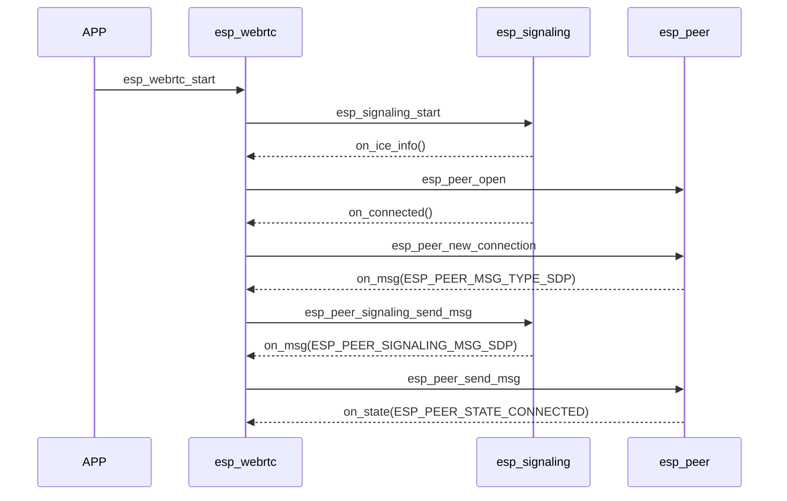
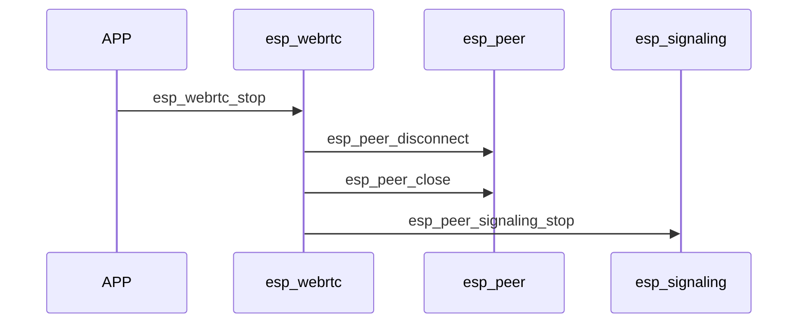
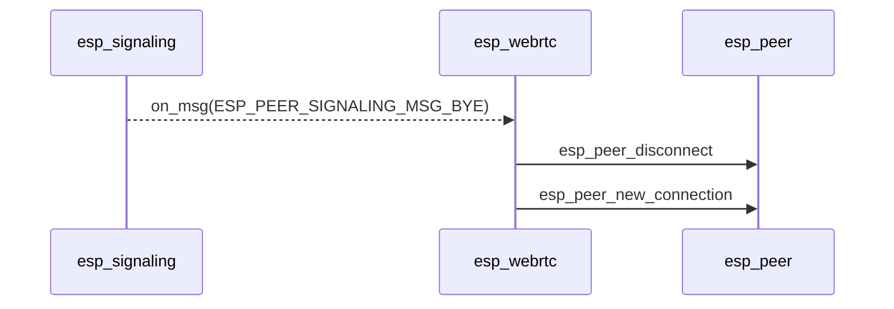

# ESP_WebRTC

`esp_webrtc` is an integrated solution for building WebRTC connections. Its base code is derived from [libpeer](https://github.com/sepfy/libpeer.git) with enhancements and improvements.

## Enhanced Features

Comparing with original `libpeer` code realization, `esp_peer` do following improvements:
1. Full support for TURN (RFC5766 and RFC8656)
2. Connection speed optimized for multiple candidates
3. Supports both Controlling and Controlled roles
4. Support RTP NACK report and handling
5. Support SACK for SCTP, support huge data split and combination
6. Easy to add customized signaling and peer connection implementation
7. Support send and receive in separate task to avoid affect each other

## Architecture

`esp_webrtc` consists of three main components:

### 1. Signaling
Signaling is used to detect peer and exchange SDP information or control commands.  
In `esp_webrtc`, signaling is abstracted as `esp_peer_signaling`.  
You can refer to the `esp_signaling_get_apprtc_impl` sample code for implementation details.

### 2. PeerConnection
PeerConnection uses ICE to find connectable peer's IP and port, then establishes connection with the peer.  
After the connection is established, users can:
- Send and receive media data (RTP payload) through PeerConnection
- Send and receive user data (DataChannel over SCTP) through PeerConnection

In `esp_webrtc` PeerConnection is abstracted as `esp_peer`.  
A default implementation is provided as `esp_peer_get_default_impl`, which users can utilize if they only require the PeerConnection functionality.

### 3. WebRTC Solution
The WebRTC solution combines signaling, PeerConnection, and a media system.  
It provides a high-level API to simplify WebRTC application development.  
Users only need to configure basic settings like audio and video codecs.  
`esp_webrtc` will do following things automatically:
- Capture and transmit audio and video streams
- Automatically render received streams using `av_render`

For customization, users only need to modify the signaling implementation.

## Usage of `esp_peer`
If user only need the Peer Connection protocol and don't require the entire WebRTC solution, can utilize the `esp_peer` API

1. **Create a PeerConnection**  
   Call `esp_peer_open` to create a PeerConnection.  
   This API should be invoked after gathering the ICE server URL.  
   If the peer is a public server, can set `server_num` to 0.

2. **Run the PeerConnection Main Loop**  
   After opening the PeerConnection, create a task to periodically call the main loop: `esp_peer_main_loop`.

3. **Initiate a New Peer Connection**  
   Call `esp_peer_new_connection` to initiate a new connection.  
   This gathers local candidates and reports the local SDP via the `on_msg` callback.  
   The user must send the SDP to the signaling server.

4. **Set Remote SDP or Candidates**  
   Upon receiving the remote SDP from the signaling server, call `esp_peer_send_msg` to set the remote SDP or candidates.

5. **Connection Establishment**  
   `esp_peer` attempts to build the connection and reports the connection status via the `on_state` callback.

6. **Send Data**  
   - Send audio: `esp_peer_send_audio`  
   - Send video: `esp_peer_send_video`  
   - Send data through the data channel: `esp_peer_send_data`

7. **Receive Data**  
   Peer-sent data is received via callbacks:  
   - `on_audio_info` and `on_audio_data` for audio information and data  
   - `on_video_info` and `on_video_data` for video information and data  
   - `on_data` for data channel messages  

8. **Disconnect the Peer**  
   Use `esp_peer_disconnect` to disconnect from the peer.

9. **Close the PeerConnection**  
   Use `esp_peer_close` to close the PeerConnection.

## Typical Call Sequence of `esp_webrtc`

### Connection Build Flow:

### Stop Flow by User:

### Disconnect Flow When Peer Normally Leaves (Signaling Still Active, Waiting for Peer to Rejoin):

## Simple Usage of `esp_webrtc`

1. Build the capture and render system.
2. Configure your WebRTC settings.
3. Start WebRTC call `esp_webrtc_start`.
4. Stop WebRTC call `esp_webrtc_stop`.
